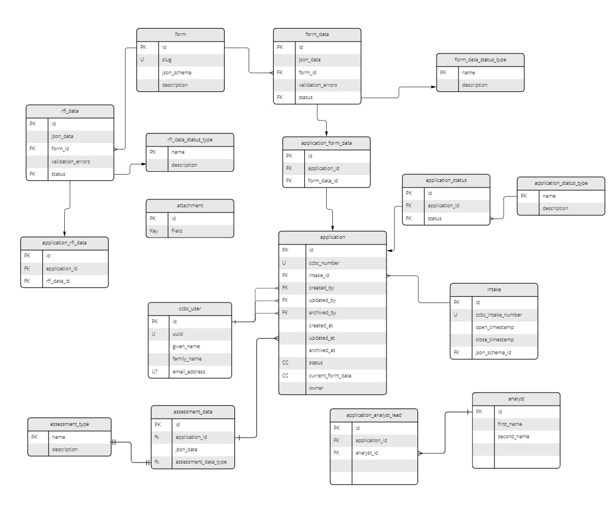

# Database schema

This folder contains the SQL code defining our database schemas. We use `sqitch` to deploy changes, and `pgTap` to test the resulting schemas.

You can find the relevant team agreements and recommendations below

## Sqitch changes

To identify which changes are released in production environments and therefore are immutable, we rely on sqitch tags: changes that are above a tag (a line starting with `@`) in the `sqitch.plan` file should be considered immutable.

When adding a sqitch change to create an object, we follow the `<object_type>/<object_name>` naming convention, where `<object_type>` is one of the following:

- `schemas`: we shouldn't need to add more than the public and private schemas
- `tables`: all tables go in there
- `types`: all composite or enum types go in there.
- `functions`: for functions that would result in a [postgraphile custom query](https://www.graphile.org/postgraphile/custom-queries/)
- `computed_columns`: for functions that would result in a [postgraphile computed column](https://www.graphile.org/postgraphile/computed-columns/)
- `mutations`: for [custom mutations](https://www.graphile.org/postgraphile/custom-mutations/)
- `trigger_functions`: for any function returning a trigger
- `util_functions`: for any function used primarily to increase code reuse, either in the public or private schema
- `views`: all views go in there

### No verify scripts

Our schema changes are tested via pgTap, made in transactions, and continuously tested, providing many guardrails against accidental changes.
The `verify` scripts are a way for sqitch to

> Verify that a database is valid relative to the plan and the verification scripts for each deployed change.

We consider these files unnecessary given all of other guardrails mentioned above, and therefore recommend to not create them.

You can skip the creation of verify scripts by using `sqitch add --without verify`

### Updating after release

Once a change is released, updating the deploy script is not possible. To update the object, the following options are available:

- **If the change is idempotent**, you can use the [sqitch rework](https://sqitch.org/docs/manual/sqitch-rework/) command;
- Otherwise, you must create a new change. The naming convention should be `<name_of_original_change>_00x_<short_description_of_change>`.

## `data` folder

The `data` folder contains the data that we want do deploy in our various environments. The sql files contained in the `data/dev`, `data/test` and `data/prod` will be executed in our dev, test and prod environments, respectively, in lexicographic order. The files will be executed after the sqitch changes are deployed, **on every deployment**. Therefore, the changes in those files should be idempotent and should rely on the `overriding system value` and `on conflict` clauses whenever possible.

In local environments, the `make deploy_dev_data`, `make deploy_test_data` and `make deploy_prod_data` can be used to deploy the sqitch changes and the data in a single command.

The `data` folder is also cypress' fixtures folder, meaning that any of the scripts in it can be run in our cypress tests using commands such as `cy.sqlFixture("dev/001_intake");`

## Metabase

Metabase uses `ccbc_readonly` user to connect to the database. If `ccbc_readonly` user needs to use any of computed columns, necessary permissions should be granted manually.

I.e. `grant execute on function ccbc_public.application_status to ccbc_readonly;`

## Database Architecture

View on this miro link: https://miro.com/app/board/uXjVOnpFeNI=/

