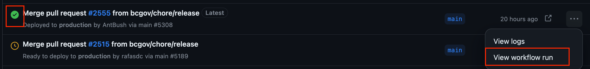

# Overview

The CBC Program Data is imported through a cron schedule at 12 pm and 4 pm daily. To successfully import these data, there are several environment variables needed:

- **SP_DOC_LIBRARY:** The SharePoint doc library where the Excel file is stored, for example, "Shared%20Documents". Note that spaces are replaced with `%20`.

- **SP_LIST_NAME:** The list name where the errors are to be pushed. Spaces must be replaced by `%20`.

- **SP_MS_FILE_NAME:** The file name, for example, "CBC Program Data.xlsx". Note that spaces can remain as is.

- **SP_SITE:** The SharePoint site where the file and list reside, for example, [https://bcgov.sharepoint.com/sites/CITZ](https://bcgov.sharepoint.com/sites/CITZ).

- **SP_SA_USER:** The SharePoint service account user.

- **SP_SA_PASSWORD:** The SharePoint service account user password.

# Changing Shared Variables

This applies to changing the user, password, or site used for the cron job, as it is shared between all three environments. As an admin, visit the Settings page of this repository and select Secrets and Variables -> Actions. Scroll all the way down, and you will see the environment variables under the heading Repository Secrets. To edit, click on the edit pencil and paste in the new value. Ensure there is no leading or trailing white space when pasting.

# Changing Per Environment Variables

This applies to the file name, list name, and document library used for the cron job. As an admin, visit the Settings page of this repository and select Environments, then choose the environment for which you need to make a change. Under Environment Secrets, find the variable you need to change and edit it with the edit pencil.

# Deploying Changes

Once you have changed the environment variables that need updating, a deployment to the modified environment(s) will be needed. This can be done by rerunning the action that deploys to that specific environment. To do so, visit the Deployments page and select the environment you need to update. Find the latest successful deployment and select View Workflow Run.

Hover next to the environment you want to redeploy and select Re-run Job. For example, if you need to redeploy to test, find `deploy-to-openshift-test` and select Re-run.

Confirm on the modal by clicking the green Re-run Jobs button and wait for deployment to complete.
