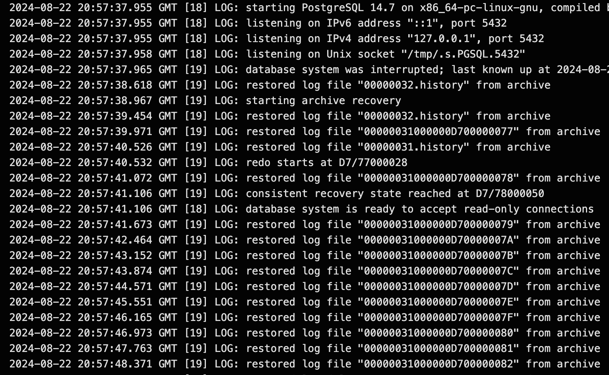

# CCBC App Full Disaster Recovery

## Introduction

The following document aims to outline the steps of restoring a Postgres database from an existing backup created with pgBackrest and subsequently deploying the application and connecting it to the restored database. The intent is to provide a run-book of steps to run in a case where the application needs to be restored and deployed from scratch due to a disaster.

## Assumptions

The following assumptions were made:

- Only the S3 backups are accessible, any other type of backups were unrecoverable or non-existent
- The app secrets are alive on GitHub and can be used to redeploy the application
- The CI/CD steps on GitHub Actions can be used for the redeployment of the application with minimal changes
- The CrunchyPostgres Helm chart is being used from https://github.com/bcgov/crunchy-postgres

## Recovering the Database

The database can be easily recovered by deploying a Crunchy cluster with the S3 bucket as the data source. We will deploy the database first, wait for the restore to occur and then deploy the application. To do so, we do the following changes to our `values.yaml` located at `helm/app`:

```yaml
deploy:
  enabled: false
crunchy-postgres:
  instances:
    replicas: 1
  dataVolumeClaimSpec:
    storage: 1Gi
  dataSource:
    enabled: true
    secretName: s3-pgbackrest
    repo:
      name: repo2
      path: '/'
      s3:
        bucket: '' #gets passed automatically via existing deploy script
        endpoint: 's3.ca-central-1.amazonaws.com'
        region: 'ca-central-1'
      stanza: db
  pgBackRest:
    s3:
      enabled: false
```

A few things to note:

- `deploy: enabled: false` tells Helm not to deploy the application.
- `dataSource: enabled: true` tells the operator to restore data from the specified data source, in this case the S3 bucket.
- The name of the repo must match the name of the repo that was previously backed up, in this case `repo2`
- The bucket name will have to point to the bucket that contains the restore data, this is set by the `AWS_S3_BACKUPS_BUCKET` environment variable, you will likely have to modify this if you are restoring from a different backup target.
- The `secretName: s3-pgbackrest` implies that a secret named `s3-pgbackrest` exists and has the necessary information to read from the the s3 bucket specified under `s3: bucket`.
- The backup is disabled for s3 to avoid de-synchronization of the existing pgBackrest process, if none is running then this can be set to on from this step.
- The secret mentioned above must be created before the deploy starts or the restore will not occur. To do so, create a key/value secret with the name `s3-pgbackrest` key name set as `s3.conf` and the value stored as follows"

```conf
[global]
repo2-s3-key=KEY_HERE
repo2-s3-key-secret=KEY_SECRET_HERE
```

### Restoring and deploying the database

Once you have made the changes mentioned above, start a deployment process. If you are deploying to a pre-existing namespace that is now empty, there shouldn't need to be any change. Nevertheless, if you are deploying to a different namespace change the secrets `OPENSHIFT_TOKEN` and `OPENSHIFT_APP_NAMESPACE` accordingly.

Note: If you are deploying to a different namespace(s) you will have to add the namespace(s) to `app/config/index.js` under OPENSHIFT_APP_NAMESPACE so it can properly run.

Once you start the deployment process with deploy set to false for the app and data source set to true for the database, you will see one job, it will be named something like `ccbc-pgbackrest-restore` this job will restore the database from the backup. The restore will take some time, your logs will look something like the below:



If you are getting errors on a new namespace and have double checked secrets and bucket names the requests might be getting blocked due to KNPs. Make sure you have set NetworkPolicies on your new namespace that will allow the job to talk to S3. Refer to the [OpenShift network policies documentation](https://developer.gov.bc.ca/docs/default/component/platform-developer-docs/docs/platform-architecture-reference/openshift-network-policies/) for more information on NetworkPolicies.

Once the restore is done the job will disappear and the database will start up along with pgbouncer and repo-host.

Note: if your repo-host stays in `pending` for too long, check the message that shows when you hover. While this guide was being written the operator could not create storage named `ccbc-repo1`, so it had to be manually created for repo-host to successfully initialize.

## Deploying the app

Once the database has been successfully restored and redeployed you are now ready to deploy the application. To do so modify the `values.yaml` file as follows:

```yaml
deploy:
  enabled: true # set to true
crunchy-postgres:
  instances:
    replicas: 1
  dataVolumeClaimSpec:
    storage: 1Gi
  dataSource:
    enabled: false #turn off
    secretName: s3-pgbackrest
    repo:
      name: repo2
      path: '/'
      s3:
        bucket: '' #gets passed automatically via existing deploy script
        endpoint: 's3.ca-central-1.amazonaws.com'
        region: 'ca-central-1'
      stanza: db
  pgBackRest:
    s3:
      enabled: false # double check before enabling
```

A few notes:

- We now re-enable deployment so that the app get deployed.
- We turn off dataSource as the database will no longer be restored.
- To re-enable pgBackRest ensure that you are either pointing to a different bucket where you want to store your backups and have updated the environment variables and secrets accordingly; OR, you are confident the other DB (the source of the restore) will no longer do backups to avoid de-synchronization; you might have already have this at `true` from the previous step if that is the case.

Once you have made those changes, start the deployment process, this will deploy the app to the environment you have chosen using the existing secrets for that environment. You might need to adjust routes, and other services as needed.
