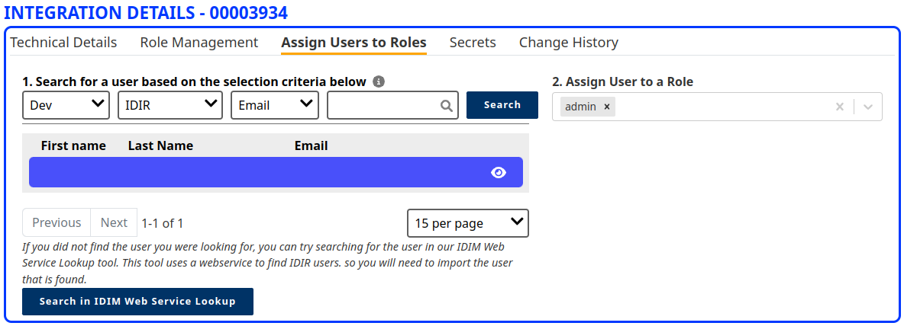

### Overview of analyst permissions

Analysts will log in through the `/analystportal` route and will use IDIR for authentication. To prevent anyone who has an IDIR from accessing the analyst dashboard an `analyst` or `admin` role will have to be tied to the IDIR through the [SSO app](https://bcgov.github.io/sso-requests). If they don't have a role assigned to their IDIR they will be redirected to `/analystportal/request-access`.

#### Assigning roles to an IDIR

Roles can be assigned to an IDIR in the SSO app. Login to the app and select the project and the section showed below will be at the bottom of the page.

In the 'Assign Users to Roles' tab you can search the IDIR you want to assign then assign it in the 'Assign user to role' section on the right side.

Allowed roles at the time of writing are:

- Admin
- Analyst
