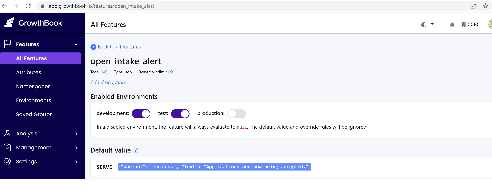

### Process to update banner message 

To be able to communicate with customers and convey messages, a special area of the initial and dashboard pages was assigned (over the page title). The message in that area can be enabled, disabled or updated via the Growthbook web application. GrowthBook is an open source platform that gives any company the power of a customized feature flagging.

Two feature flags are supported:
- `open_intake_alert`
- `closed_intake_alert`

Both feature flags are defined as JSON objects with the following structure:
{"variant": "success", "text": "Applications are now being accepted until [DATE].", "displayOpenDate" : true, "dateTimestamp": "2022-10-01"}

"variant" can be one of the following:
- "success"
- "info"
- "warning"
- "danger"

"text" is the text of the message; it can have the merge field `[DATE]` which will be replaced with the value provided in the "dateTimestamp" attribute if the "displayOpenDate" attribute is set to `true`

### Screenshots

#### Open intake feature flag

